# Graph surgery

This section describes graph surgery and its use in optimizing Machine Learning/AI models to successfully compile and deploy on a targeted device (in this case a SiMa device).

## What is Graph Surgery

Graph surgery is the process of modifying the structure of a computational graph (Neural Network model) to meet specific objectives in machine/deep learning use cases (models).

## Why Do You Need to Perform Graph Surgery

Graph surgery is needed in the following scenarios:

- To customize a pre-trained model

- To optimize the model for a specific device (for example, edge devices)

- To enhance the efficiency of a model

## Graph Surgery Using SiMa Tools

While the Palette software (the ModelSDK component) is continuously updated to support new operators, it is sometimes required to perform graph surgery on certain models so that those models can be compiled to run entirely on the MLA.

For example, non-4D tensors are reshaped to 4D, non-supported operators are replaced by supported operators. This document describes an API and recommended practices to perform graph surgery on ONNX models using the ModelSDK component of the Palette software.

The sima-utils package is included in the ModelSDK component of the Palette software and can be invoked by importing the Python package as shown below. For a detailed list of functions refer to API references.

``` python
from sima_utils.onnx import onnx_helpers as oh
```

### Analyzing a Model

The Sima MLSoC contains MLA, CVU (EV74), and APU (A65) as backends. When a model is compiled by the ModelSDK, operators are assigned to the MLA with best effort; if this fails, they are mapped to the CVU or APU, producing multiple MLA segments represented by multiple LM files. To achieve the best performance, it is desirable to modify the model so that it is assigned to the MLA in its entirety. When the model is completely assigned to the MLA, compilation will produce a single LM file.

When multiple LM files are generated after compiling a model using the ModelSDK, those operators between MLA segments may be modified or replaced by other operators so that the whole model may be assigned to MLA.

An analysis needs to be done to decide where and how a model can be modified. Identifying which nodes to perform graph surgery is one skill, which can be assisted by running ModelSDK. Knowing what operators to replace with is another skill, which requires knowledge of ML operators, DSP processing, and MLA support.

Follow the guideline below when performing graph surgery.

1.  Compile a model using the ModelSDK to identify layers not mapped to MLA. Those layers are mapped to CVU or APU; they can be identified by saving and viewing the SiMa IR graph in Netron or enabling verbose logging in the ModelSDK.

2.  Perform graph surgery on those identified layers. If those layers are throughout the whole model, a divide-and-conquer approach is recommended to split the model first.

3.  Save the modified model. Merge the modified sub-graphs if the original model has been split.

4.  Run inferencing with the original model and the modified model and compare the outputs. If a graph surgery only involves data reshuffling, like reshape, slice, concat, and transpose, expect to see an identical match numerically between the original output and the modified output. If a graph surgery changes any math processing order of tensors, there will be no identical match, but generally expect to see a maximum difference around 1e-6 numerically (1e-4 is seen with DETR modification).

5.  Compile the modified model with ModelSDK and confirm a single LM file is generated.

For MLA supported operators, see [Model Compatibility Guide](./model-compatibility.md).

### ONNX Model

ONNX is an [open specification](https://onnx.ai/onnx/). The ONNX format is embedded in protobuf (specifically, the subset of protobuf that is compatible with both protobuf v2 and v3), and so it is built on the data model of Protocol Buffers.

Semantically, the ONNX specification consists of the following components:

- A definition of an extensible computation graph model;

- Definitions of standard data types;

- Definitions of built-in operators.

The first two items above make up the ONNX Intermediate Representation (IR). The built-in operators are covered by the OPSET specification. See figure below.


An ONNX graph defines the computational logic of a model and consists of a parameterized list of nodes that form a directed acyclic graph based on their inputs and outputs. This is the equivalent of a **network** or **graph** in other deep learning frameworks.

Entities in an ONNX graph are referenced by name. Names of values (graph or node inputs, graph or node outputs, and constants) inhabit a single namespace. Names of nodes inhabit another namespace. What we think of as a graph edge consists of two parts in the ONNX format: a reference to some value’s name in one node’s output list, and a reference to the same name in another node’s input list. That is, if one node’s output list contains the name “foo” and another node’s input list contains the same name “foo”, that represents a graph edge between the two nodes.

- **Graph Level Access**

Once a model is loaded, the graph can be accessed by the following data structures:

- List of nodes: model.graph.node

- List of inputs: model.graph.input

- List of outputs: model.graph.output

- List of constants: model.graph.initializer

Each component can be removed, modified, or added to the graph.

- **Node Level Access**

A node (model.graph.node) in the graph can be accessed by the following data structures:

- Name: node.name

- Operator: node.op_type

- List of inputs: node.input

- List of outputs: node.output

- List of attributes: node.attribute

Each component can be removed, modified, or added to a node.

- **Model Validation**

An ONNX file (or model) is just a proto message. Any tools that can read or write to proto messages can be used to explore an ONNX model. To validate an ONNX model, however, a validation tool (onnx.checker) is developed in C++ with a Python wrapper. The model checker, onnx.checker.check_model, validates an ONNX model by performing the following checks:

- IR version conflict

- Opset conflict: Operator in a graph follows its most recent definition below or equal the graph Opset version

- Consistency of a model

After a model is modified by graph surgery, the model checker should always be called to validate the modified model before saving it to disk.

Once a model is analyzed, follow the steps below to perform graph surgery.

1.  Load an ONNX model.

2.  Perform the surgery.

3.  Remove the existing inferencing shape information.

4.  Save the modified model.

5.  Verify the accuracy of the modified model.

## Example Case Studies

The following case studies are presented to show how graph surgery is performed in different scenarios.

### UFLD: Simple Operator Replacement

The UFLD baseline model [ufld_baseline.onnx](https://docs.sima.ai/assets/graph-surgery/ufld_baseline.onnx) is compiled through ModelSDK to generate a single LM file. However, the last few layers are mapped to the CVU and the APU.

Turning on verbose logging in the quantize API (setting log_level = logging.INFO), we see why those operators are not mapped to MLA.

``` console
2024-03-12 12:07:05,837 - afe.backends.mla.mla_checkers - INFO - Cannot assign
node nn.batch_flatten_32 to MLA.
['Unsupported']
2024-03-12 12:07:05,838 - afe.backends.mla.mla_checkers - INFO - Cannot assign
node strided_slice_33 to MLA.
['Input is not 4D tensor', 'Input is not 4D tensor']
2024-03-12 12:07:05,838 - afe.backends.mla.mla_checkers - INFO - Cannot assign
node reshape_34 to MLA.
['Unsupported']
2024-03-12 12:07:05,839 - afe.backends.mla.mla_checkers - INFO - Cannot assign
node layout_transform_35 to MLA.
['Unsupported']
2024-03-12 12:07:05,840 - afe.backends.mla.mla_checkers - INFO - Cannot assign
node strided_slice_36 to MLA.
['Input is not 4D tensor', 'Input is not 4D tensor']
2024-03-12 12:07:05,841 - afe.backends.mla.mla_checkers - INFO - Cannot assign
node reshape_37 to MLA.
['Unsupported']
2024-03-12 12:07:05,842 - afe.backends.mla.mla_checkers - INFO - Cannot assign
node layout_transform_38 to MLA.
['Unsupported']
2024-03-12 12:07:05,843 - afe.backends.mla.mla_checkers - INFO - Cannot assign
node strided_slice_39 to MLA.
['Input is not 4D tensor', 'Input is not 4D tensor']
2024-03-12 12:07:05,844 - afe.backends.mla.mla_checkers - INFO - Cannot assign
node reshape_40 to MLA.
['Unsupported']
2024-03-12 12:07:05,844 - afe.backends.mla.mla_checkers - INFO - Cannot assign
node layout_transform_41 to MLA.
['Unsupported']
2024-03-12 12:07:05,845 - afe.backends.mla.mla_checkers - INFO - Cannot assign
node strided_slice_42 to MLA.
['Input is not 4D tensor', 'Input is not 4D tensor']
2024-03-12 12:07:05,846 - afe.backends.mla.mla_checkers - INFO - Cannot assign
node reshape_43 to MLA.
['Unsupported']
2024-03-12 12:07:05,847 - afe.backends.mla.mla_checkers - INFO - Cannot assign
node layout_transform_44 to MLA.
['Unsupported']
```

The last few layers of the model in Netron are shown in the figure below. There are 5 reshape nodes which are not yet supported by the MLA; hence they are mapped to the CVU. Those 4 slice nodes after reshape process tensors in 2D; they are mapped to the APU because the MLA only supports 4D. To modify the model so that it is mapped entirely to the MLA, we need to remove unsupported operators and modify 2D tensors to 4D.

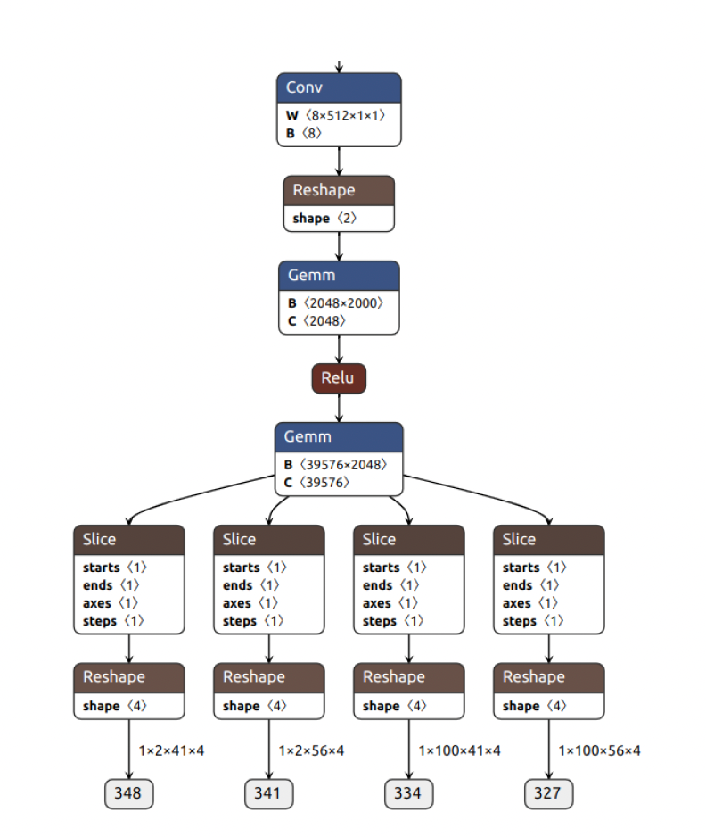

To modify the model so that it is mapped to the MLA entirely, we need to remove unsupported operators and modify 2D tensors to 4D tensors.

**Steps**

1.  Remove nodes.

    For some models that follow a well defined naming convention, we can define nodes to be removed by a dictionary with key being the node name and value being the number of instances.

    ``` python
    _ops_to_be_removed: Dict[str, int] = {
    "Reshape": 5,
    "Slice": 4
    }


    def _make_remove_list(ops_dict: Dict[str, int]):
    remove_list = []
    for k, v in ops_dict.items():
    for i in range(v):
       node_name = f"/{k}" if i==0 else f"/{k}_{i}"
       remove_list.append(node_name)

    return remove_list
    # Remove nodes
    remove_list = _make_remove_list(_ops_to_be_removed)
    oh.remove_nodes_by_name_list(model, remove_list
    ```

2.  Rewrite Gemm after 1st reshape.

    In the original model, the output of “/pool/Conv” is reshaped from (1, 8, 10, 25) NCHW to (1, 2000), then processed by the Gemm to output (1, 2048). We remove the reshape and keep tensors as 4D through the Gemm. Typically, a 2D Gemm is converted to a convolution node in 4D. To take input as (1, 8, 10, 25) and output 2048 channels, the shape of the kernel of the convolution needs to be (10, 25) and the shape of the weight (10, 25, 8, 2048). After the rewrite, the output becomes (1, 2048, 1, 1) NCHW.

    ``` python
    # Replace Gemm with Conv
    after_node = "/pool/Conv"
    at_node = "/cls/cls.1/Gemm"
    new_conv_node = oh.rewrite_gemm_as_conv(model, after_node, at_node,
                                            R=10, S=25, C=8, K=2048)
    ```

3.  Rewrite Gemm + slice.

    In the original model, the output of the Gemm prior to slices is (1, 39576). The slices partition the output on axis 1 into 4 non-overlapping lengths: 22400, 16400, 448, 328. The Gemm plus slices can be rewritten as 4 convolutions, taking input as (1, 2048, 1, 1) NCHW and producing output as (1, 22400, 1, 1), (1, 16400, 1, 1), (1, 448, 1, 1), and (1, 328, 1, 1), respectively. The kernel shape of those 4 convolutions is (1, 1). The weights tensors are to be sliced from the matrix tensor of the Gemm.

    ``` python
    def _rewrite_gemm_as_sliced_conv(model, at_node, *, R, S, C, K_slices,
                            output_names):
    assert len(K_slices) == len(output_names)
    new_node_names = []
    for idx, node in enumerate(model.graph.node):
        if node.name == at_node:
            assert node.op_type == "Gemm"
            model.graph.node.remove(node)


            gemm_w = oh.find_initializer_value(model, node.input[1])
            gemm_b = oh.find_initializer_value(model, node.input[2])
            oh.remove_initializers(model, [node.input[1], node.input[2]])


       slice_begin = 0
       for k in range(len(K_slices)):
           new_node_name = node.name + f"_Conv_{k}"
           new_w_name = f"sliced_conv_w_{k}"
           new_bias_name = f"sliced_conv_bias_{k}"
           model.graph.node.insert(
               idx + k,
               onnx.helper.make_node(
                   op_type="Conv",
                   name=new_node_name,
                   inputs=[node.input[0], new_w_name, new_bias_name],
                   outputs=[output_names[k]],
                   kernel_shape=(R, S),
               )
           )
           new_node_names.append(new_node_name)
           # New Weight
           slice_end = slice_begin + K_slices[k]
           w = gemm_w[slice_begin:slice_end, :] \
               .reshape(K_slices[k], C, R, S)
           oh.add_initializer(model, new_w_name, w)
           bias = gemm_b[slice_begin:slice_end]
           oh.add_initializer(model, new_bias_name, bias)
           slice_begin = slice_end
    ```

    return new_node_names

    ``` python
    # Gemm + 4x Slice with 4x Conv
       at_node = "/cls/cls.3/Gemm"
       _rewrite_gemm_as_sliced_conv(model, at_node, R=1, S=1, C=2048,
                            K_slices=[22400, 16400, 448, 328],
                            output_names=_model_output_name)
    ```

4.  Update outputs.

    Once the outputs of step 3, above, become the outputs of the model, we need to update the output tensors.

    ``` python
    _model_output_shape = [
     (1, 100, 56, 4), (1, 100, 41, 4), (1, 2, 56, 4), (1, 2, 41, 4)
     ]
     _model_output_name = [
     "327", "334", "341", "348"
     ]
     _opt_output_shape = [
     (1, 22400, 1, 1), (1, 16400, 1, 1), (1, 448, 1, 1), (1, 328, 1, 1)
     ]

     for i in range(len(_model_output_name)):
     oh.update_io_shape(model, _model_output_name[i],
                _opt_output_shape[i])
    ```

5.  Save the modified model.

    As a first step, the existing shape information needs to be erased.

    ``` python
    # Remove existing shape inference results.
    for value_info in list(model.graph.value_info):
    model.graph.value_info.remove(value_info)
    ```

    The model is simplified, checked, and saved.

    ``` python
    model, check = simplify(model)
    model = onnx.shape_inference.infer_shapes(model)
    onnx.checker.check_model(model)
    onnx.save(model, opt_fname)
    ```

    Loading the modified model in Netron, we see the last few layers are all mapped to MLA.

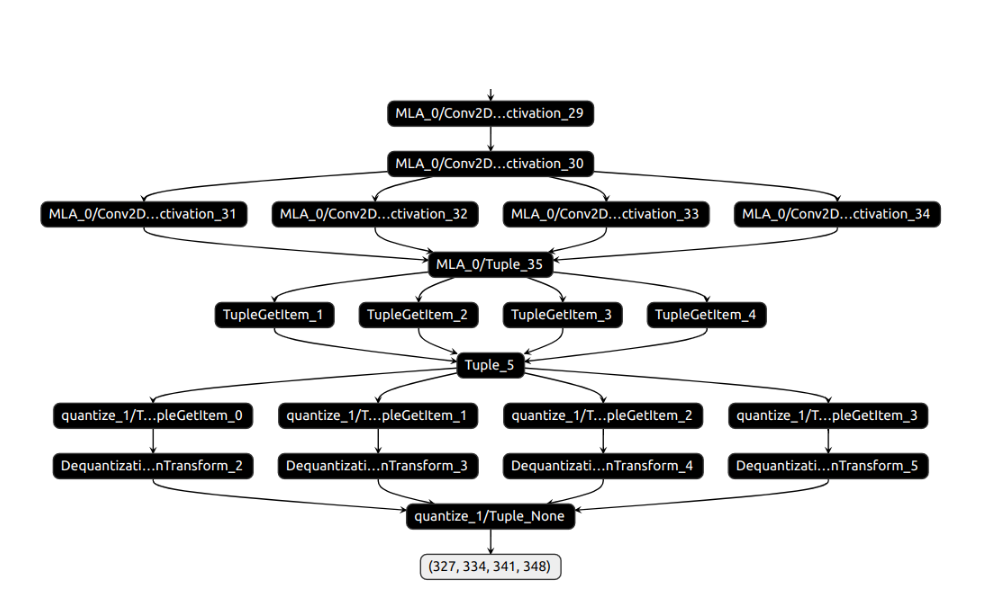

6.  Verify the modification.

    As the math processing order is changed in the modification, we expect to see a numerical difference around 1e-06 in verification.

    ``` python
    ref_outputs = oh.run_model(src_model, input_names, input_data)
    new_outputs = oh.run_model(opt_model, input_names, input_data)


    assert len(output_shapes) == len(new_outputs)


    for i, no in enumerate(new_outputs):
        opt_output = no.reshape(output_shapes[i])
        diff = ref_outputs[i] - opt_output
        print(f"Output {i}, shape {opt_output.shape},
                diff: min = {np.min(diff)}, max = {np.max(diff)}")
    ```

### YoloV8: Output to be Modified

The simplified YoloV8 segmentation model cannot be mapped the MLA entirely due to unsupported reshape and transpose operators, and non-4D tensors near the output end. The model needs to be optimized to process 4D tensors throughout the whole model.

We need to analyze the model to understand how the outputs are generated. For the referenced model, input image resolution is 480x640, which produces feature maps at 3 different scales: 60x80, 30x40, 15x20; hence there are 6300 total detections.

The segmentation model has two output tensors:

- Prediction of bounding boxes, class probabilities, and mask coefficients \* Tensor shape 1x123x6300 \* 123 = 4 BBoxes + 87 classes + 32 mask coefficients

- Mask 1x32x120x160

The diagram below shows how the bounding box and class probability output tensors are combined together.

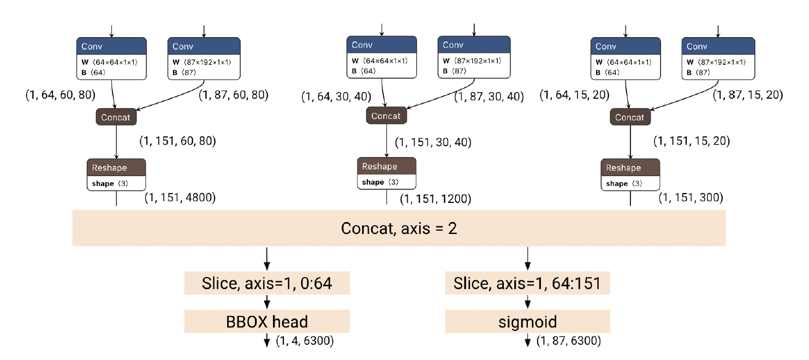

- **Mask**

  The mask tensor of shape (1, 32, 120, 160) is kept as is.

- **Mask Coefficient**

  The mask coefficient tensor of shape (1, 32, 6300) is output as 3 tensors without reshape and concat: (1, 32, 60, 80), (1, 32, 30, 40), and (1, 32, 15, 20). In NHWC layout, as is the case for MLA, when these 3 tensors, (1, 60, 80, 32), (1, 30, 40, 32), and (1, 15, 20, 32), are stored contiguously in the memory, they are the same as one (1, 6300, 32) tensor in NHWC.

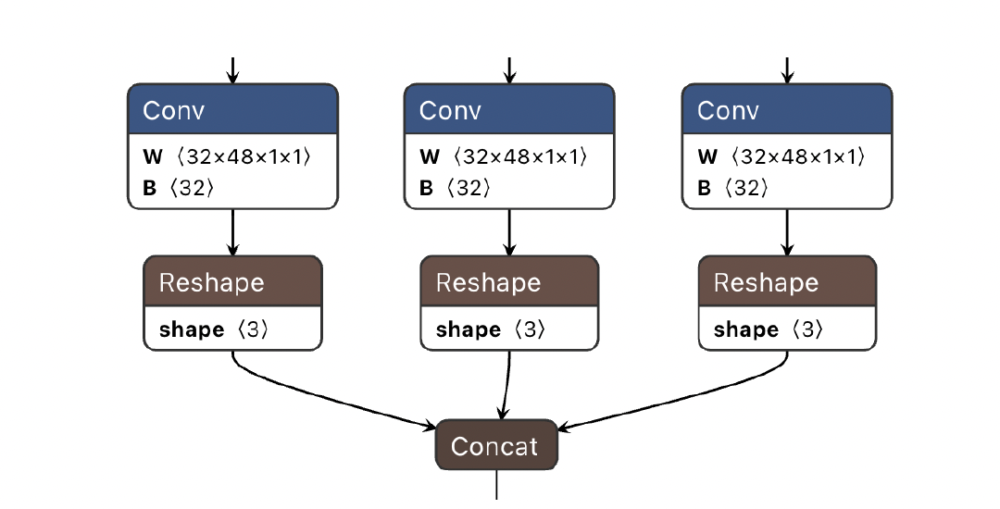

- **Class Probability**

  The class probability tensor of shape (1, 87, 6300) is output as 3 tensors after sigmoid: (1, 87, 60, 80), (1, 87, 30, 40), and (1, 87, 15, 20). In NHWC layout, as is the case for MLA, when these 3 tensors, (1, 60, 80, 87), (1, 30, 40, 87), and (1, 15, 20, 87), are stored contiguously in the memory, they are the same as one (1, 6300, 87) tensor in NHWC.

- **Bounding Box**

  The Bounding Box head needs a rewrite so that 4D tensors are processed throughout. One solution is to use slicing to create more parallel paths to avoid reshape and transpose.

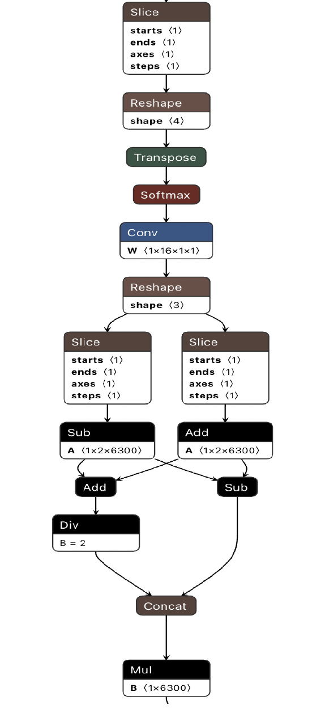 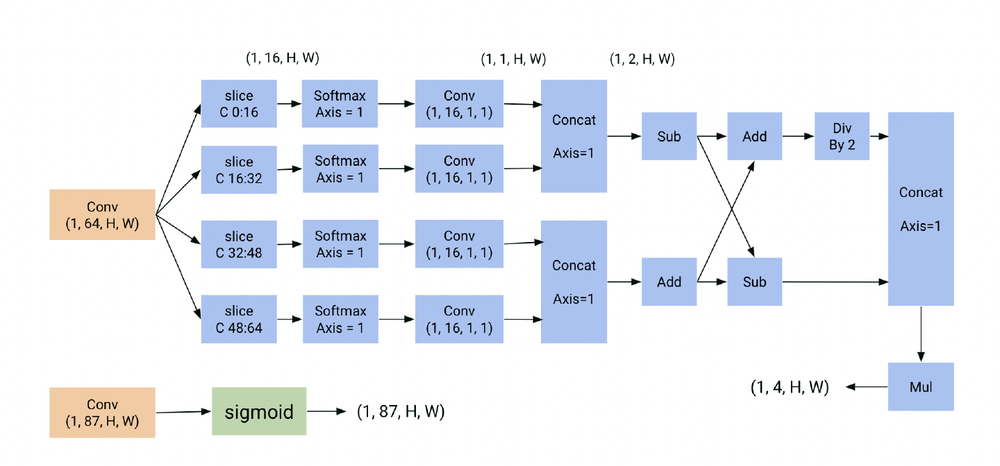

Graph surgery can be performed according to the new graph diagram.

### Post Processing

Instead of receiving two output tensors, the postprocessing function now receives 10 output tensors (represented by NCHW layout here):

- Mask (1, 32, 120, 160), same as before

- Mask coefficients \* (1, 32, 60, 80) \* (1, 32, 30, 40) \* (1, 32, 15, 20)

- BBOX \* (1, 1, 4, 4800) or (1, 4, 60, 80) \* (1, 1, 4, 1200) or (1, 4, 30, 40) \* (1, 1, 4, 300) or (1, 4, 15, 20)

- Class probability \* (1, 87, 60, 80) \* (1, 87, 30, 40) \* (1, 87, 15, 20)

Here is a script to combine the modified model outputs to be the original outputs.

``` console
opt_outputs = opt_loaded_net.execute(inputs)
for k, output in enumerate(opt_outputs):
print(f"\toutput {k}: {output.shape}")
# Opt outputs: 10 tensors
# output 0: (1, 60, 80, 4)
# output 1: (1, 30, 40, 4)
# output 2: (1, 15, 20, 4)
# output 3: (1, 60, 80, 87)
# output 4: (1, 30, 40, 87)
# output 5: (1, 15, 20, 87)
# output 6: (1, 60, 80, 32)
# output 7: (1, 30, 40, 32)
# output 8: (1, 15, 20, 32)
# output 9: (1, 120, 160, 32)
# Mask (1, 120, 160, 32)
# BBOX: (1, 60, 80, 4), (1, 30, 40, 4), (1, 15, 20, 4)
# Prob: (1, 60, 80, 87), (1, 30, 40, 87), (1, 15, 20, 87)
# Mcoeff: (1, 60, 80, 32), (1, 30, 40, 32), (1, 15, 20, 32)
pred_bbox = []
for k in range(0, 3):
bbox = opt_outputs[k]
pred_bbox.append(bbox.reshape(1, -1, 4))
pred_bbox = np.concatenate(pred_bbox, axis=1)
pred_prob = []
for k in range(3, 6):
p = opt_outputs[k]
pred_prob.append(p.reshape(1, -1, 87))
pred_prob = np.concatenate(pred_prob, axis=1)
pred_coef = []
for k in range(6, 9):
coef = opt_outputs[k]
pred_coef.append(coef.reshape(1, -1, 32))
pred_coef = np.concatenate(pred_coef, axis=1)
pred = np.concatenate([pred_bbox, pred_prob, pred_coef],
axis=2).transpose(0, 2, 1)
## opt_outputs[9] is the original mask output
## pred is the original prediction output
```

### ViT-s14

ViT-s14 is a Vision Transformer small model with a patch size of 14. The model consists of 12 identical blocks, each consisting of two sub-blocks. There are some layers that are preparing the model input for processing that is done inside the transformer blocks and there are some layers that postprocess the output from the blocks. The figure below provides an overview of the model.

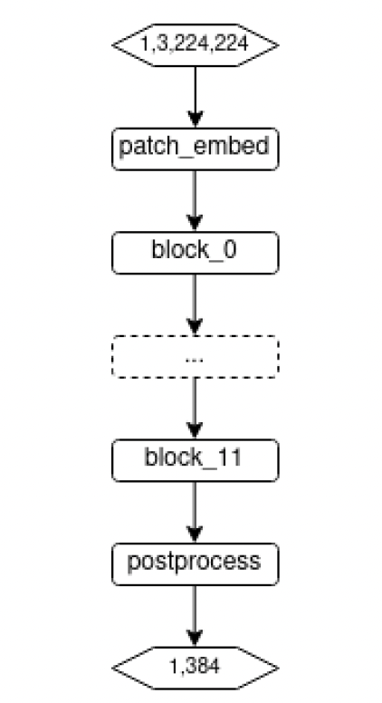

The ViT model needs a rewrite such that the 4D tensors are processed throughout the entire model. Therefore, it is necessary to split the model first and use a divide-and-conquer approach to modify each part.

### Pre-Processing

This block is a preprocessing block prior to the sequence of Transformer blocks. The figure below provides the topology of the original model and the optimized model which can be fully mapped to the MLA backend.

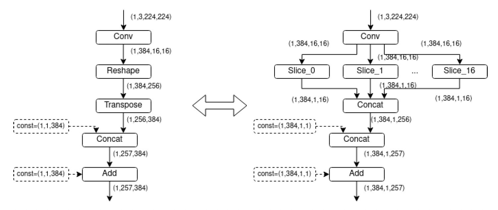 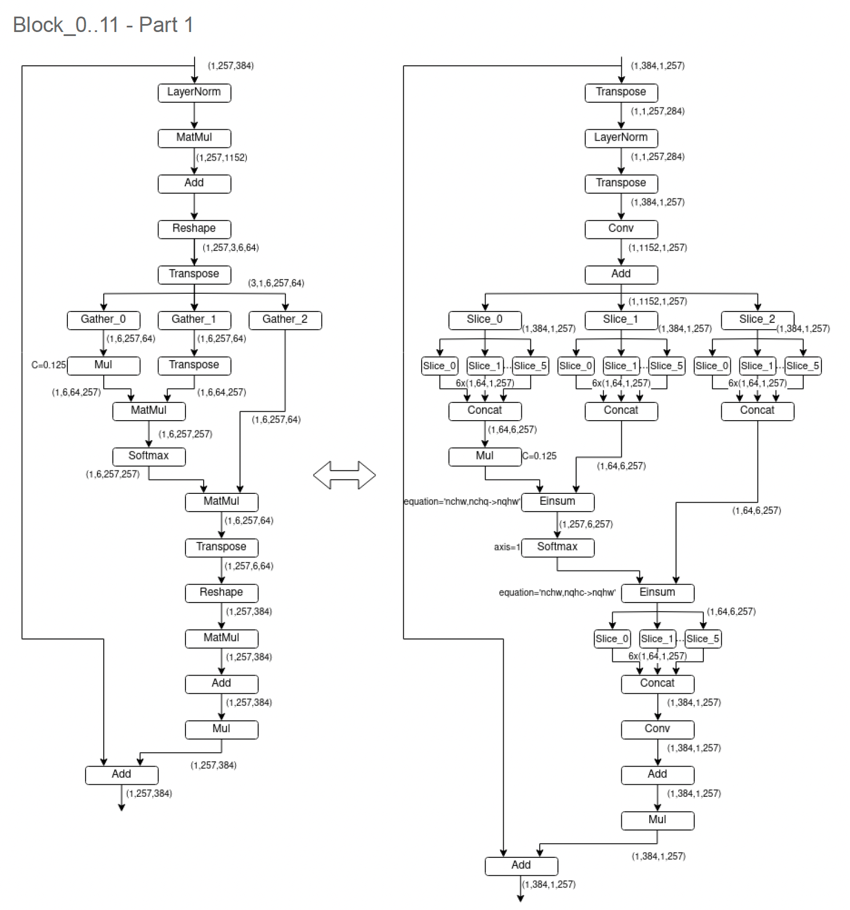 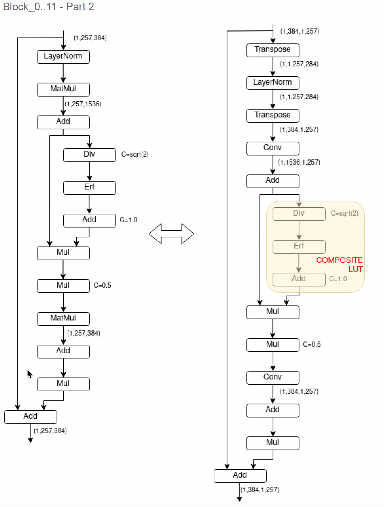

The shaded composite operator may need further optimization.

### Post-Processing

The image below shows the rewritten model fully mappable to the MLA. The shaded layer cannot be supported on the MLA. This node should be removed and the model’s output needs to be converted to compensate for shape mismatch.

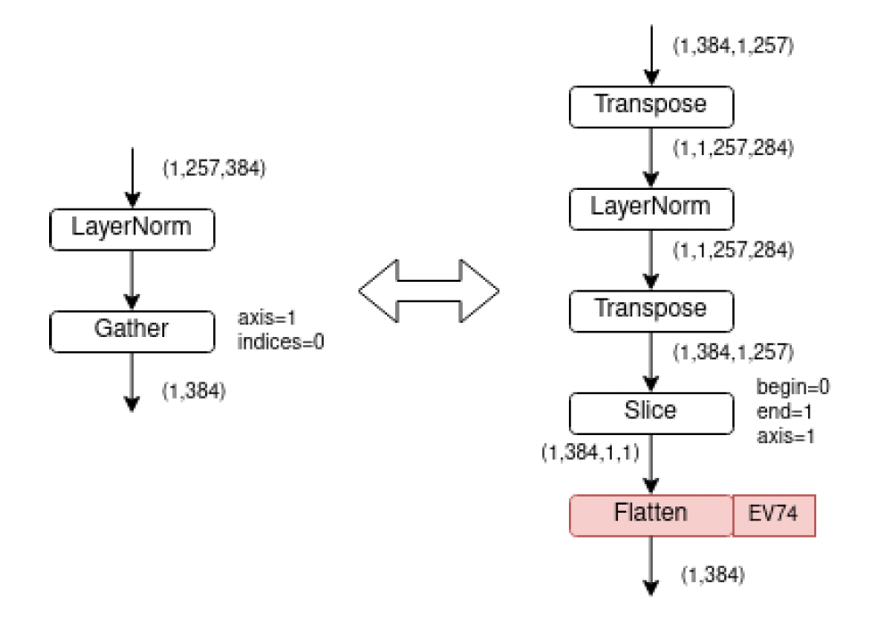
