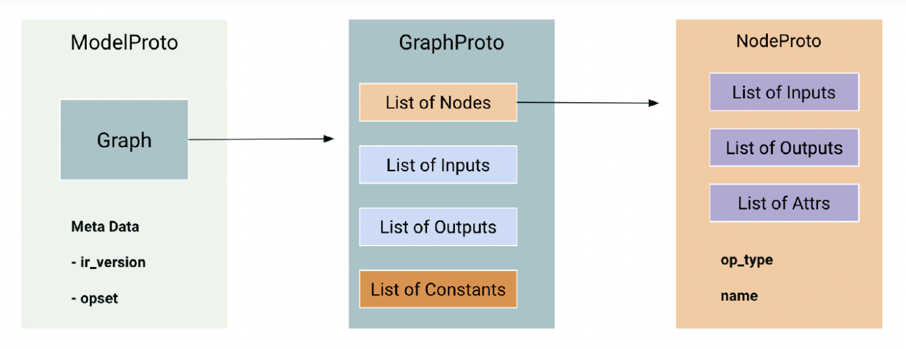

# 그래프 수술

대부분의 모델은 해당 연산자와 텐서 형식이 Model Compiler에서 지원되는 경우 직접 컴파일할 수 있습니다. 모델을 변경하기 전에 [모델 호환성](./model-compatibility.md) 목록을 확인하고 먼저 표준 컴파일 흐름을 시도하십시오.

그래프 수술은 깨끗하게 컴파일되거나 SiMa 장치에서 효율적으로 실행되기 전에 대상 그래프 변경이 필요한 모델에 대한 고급 단계입니다. 원래 Python 모델 코드에서 해당 변경을 수행하고 모델을 다시 내보내거나, 내보낸 ONNX 그래프를 직접 편집할 수 있습니다.

SDK에는 Codex 및 Claude용으로 미리 빌드된 `sima-model-surgery` 기능이 포함되어 있습니다. 에이전트에게 모델을 검사하도록 요청하면 호환성을 확인하고, 필요한 그래프 편집을 제안하고 적용하며, 결과를 검증하고, 모델을 다른 컴파일 시도에 대비할 수 있습니다. 이 기능은 특히 그래프 수술을 통해 컴파일러 호환성을 개선하고 SiMa 런타임에 대한 모델 출력을 최적화할 수 있는 YOLO 모델에 유용합니다.

예를 들어 다음과 같이 요청할 수 있습니다.

```text
Use the sima-model-surgery skill to inspect my YOLO model, optimize unsupported
graph sections, and validate the modified model.
```

## 그래프 수술을 이해합니다.

그래프 수술은 신경망 계산 그래프의 구조를 변경합니다. 모델이 양자화, 컴파일 또는 배포 전에 특정 변경이 필요한 경우 사용합니다.

일반적인 이유는 다음과 같습니다.

- 미리 학습된 모델을 사용자 정의합니다.
- Model Compiler에서 지원하지 않는 연산자를 다른 것으로 대체합니다.
- 효율적인 컴파일을 방해하는 그래프 연산을 재구성하거나 다시 작성합니다.
- 모델 그래프를 최적화하여 모델의 더 많은 부분이 MLA에서 실행되도록 합니다.
- 특정 장치 또는 배포 제약 조건에 맞게 모델을 조정합니다.

## 변경을 적용할 위치를 선택하세요.

그 Model Compiler 추가 연산자에 대한 지원을 통해 정기적으로 업데이트됩니다.

일부 모델은 모든 레이어를 MLA에서 실행하거나 모델이 성능 목표에 도달하기 전에 여전히 그래프 수정을 거쳐야 합니다.

가능한 경우 소스 모델 코드에서 변경을 수행합니다. PyTorch 또는
TensorFlow 내보낸 모델을 생성한 모듈입니다. 소스 수준의 수정은 일반적으로 검토, 테스트 및 유지 관리가 더 쉽습니다.

소스 수준의 변경이 실용적이지 않은 경우, 내보낸 모델을 수정합니다. ONNX 그래프
직접적으로. 이 페이지의 나머지 부분에서는 다음 내용을 중점적으로 다룹니다. ONNX 그래프 구조이므로 ONNX 이며, 이는 해당 시스템에서 사용하는 데이터 교환 형식입니다. Model Compiler예를 들어, 4차원이 아닌 텐서를 4차원으로 재구성하거나 지원되지 않는 연산자를 지원되는 다른 연산자로 바꿀 수 있습니다. Model Compiler 다음이 포함됩니다. `sima-utils` 패키지. 다음을 가져옵니다. ONNX 도움말

그래프를 수정하기 전에 사용해야 하는 모듈:

``` python
from sima_utils.onnx import onnx_helpers as oh
```

다음과 같은 경우: Model Compiler API, 다음을 참조하십시오. [AFE API 레퍼런스](/reference/model-sdk-api/).

## MLA 적용 범위 분석

시마 MLSoC 다음 실행 환경을 사용합니다.

- 현대 언어 협회
- CVU(EV74)
- APU(A65)

컴파일 과정에서 Model Compiler는 가능한 경우 연산자를 MLA에 할당합니다. MLA에서 실행할 수 없는 연산자는 CVU 또는 APU에 매핑됩니다. 이렇게 하면 모델이 여러 개의 MLA 세그먼트로 분할되고 여러 개의 `.elf` 파일이 생성될 수 있습니다.

최적의 성능을 위해 모델을 수정하여 더 많은 부분이 MLA에서 실행되도록 합니다. 모델 전체가 MLA에 매핑되면 컴파일 결과 단일 `.elf` 파일이 생성됩니다.

MLA에 매핑되지 않는 레이어를 먼저 찾습니다. 그런 다음 대체하거나 재구성할 연산자를 결정합니다. 이를 위해서는 Model Compiler 출력과 ML 연산자, DSP 처리 및 MLA 지원에 대한 지식이 모두 필요합니다.

## 그래프를 수정하세요.

그래프 수정을 수행할 때 다음 워크플로를 사용하세요.

1. Model Compiler를 사용하여 모델을 컴파일합니다.
2. MLA에 매핑되지 않는 레이어를 식별합니다. SiMa IR 그래프를 저장하고 검사합니다.
   Netron에서 자세한 로그를 활성화하거나 Model Compiler를 사용합니다.
3. 식별된 레이어를 수정합니다. 레이어가 모델 전체에 걸쳐 나타나는 경우,
   먼저 모델을 분할한 다음, 한 번에 한 섹션씩 수정합니다.
4. 수정된 모델을 저장합니다. 모델을 분할한 경우, 수정된 모델을 병합합니다.
   하위 그래프.
5. 원본 모델과 수정된 모델을 사용하여 추론을 실행합니다. 결과를 비교합니다.
   출력 결과.
6. 수정된 모델을 Model Compiler를 사용하여 컴파일합니다.
7. 전체 MLA 적용 시 컴파일 결과가 하나의 `.elf` 파일로 생성되는지 확인합니다.
   이것이 목표입니다.

`Reshape`, `Slice`, `Concat` 및 `Transpose`와 같은 데이터 재구성 변경의 경우, 원래 출력과 수정된 출력이 수치적으로 일치해야 합니다. 변경 사항이 수학적 순서를 변경하는 경우, 정확히 일치할 것으로 예상되지 않습니다. 이러한 경우, 수치적 차이와 모델 수준의 정확도를 평가합니다.

MLA 연산자 지원에 대해서는 [모델 호환성](./model-compatibility.md)를 참조하십시오.

## ONNX 그래프 구조를 검토합니다.

ONNX는 프로토콜 버퍼를 기반으로 하는 [오픈 스펙](https://onnx.ai/onnx/)입니다. ONNX 모델은 다음을 포함합니다.

- 확장 가능한 계산 그래프 모델
- 표준 데이터 유형
- 내장 연산자

그래프 모델과 데이터 유형은 ONNX 중간 표현(IR)을 구성합니다. 내장 연산자는 OPSET 사양에 의해 정의됩니다.



ONNX 그래프는 모델 계산을 정의합니다. 여기에는 입력과 출력을 통해 방향성 비순환 그래프를 형성하는 노드가 포함됩니다. 이는 다른 딥 러닝 프레임워크의 **네트워크** 또는 **그래프**와 동일합니다.

ONNX 그래프 엔터티는 이름으로 참조됩니다.

- 값 이름에는 그래프 입력, 그래프 출력, 노드 입력, 노드 출력이 포함됩니다.
  그리고 상수들입니다.
- 노드 이름은 별도의 네임스페이스를 사용합니다.
- 어떤 노드의 출력과 다른 노드의 입력이 동일한 대상을 참조할 때 그래프의 간선이 존재합니다.
  동일한 값을 갖는 이름입니다.

## 그래프 필드에 접근합니다.

모델을 불러온 후에는 다음을 통해 그래프 수준의 필드에 접근할 수 있습니다.

- `model.graph.node`: 노드
- `model.graph.input`: 그래프 입력
- `model.graph.output`: 그래프 출력
- `model.graph.initializer`: 상수

그래프 수준의 구성 요소를 제거, 수정 또는 추가할 수 있습니다.

다음과 같이 노드 수준의 필드에 액세스합니다.

- `node.name`: 노드 이름
- `node.op_type`: 연산자 유형
- `node.input`: 노드 입력
- `node.output`: 노드의 출력 결과
- `node.attribute`: 노드 속성

노드 수준의 구성 요소를 제거, 수정 또는 추가할 수 있습니다.

## 수정된 모델을 검증합니다.

ONNX 파일은 프로토콜 버퍼 메시지입니다. 프로토콜 버퍼 메시지를 읽거나 쓸 수 있는 모든 도구를 사용하여 확인할 수 있습니다. ONNX 모델을 검증하려면 `onnx.checker.check_model`을 사용하십시오.

모델 검사기는 다음을 검증합니다.

- IR 버전 호환성
- OPSET 호환성
- 모델 일관성

그래프 수정을 완료한 후와 수정된 모델을 디스크에 저장하기 전에 항상 모델 검사기를 호출하십시오.

다음의 최종 검증 워크플로를 사용하십시오.

1. ONNX 모델을 불러옵니다.
2. 그래프 수술을 수행합니다.
3. 기존 추론 형태 정보를 제거합니다.
4. 수정된 모델을 `onnx.checker.check_model`을 사용하여 검증합니다.
5. 수정된 모델을 저장합니다.
6. 수정된 모델의 정확도를 확인하십시오.
